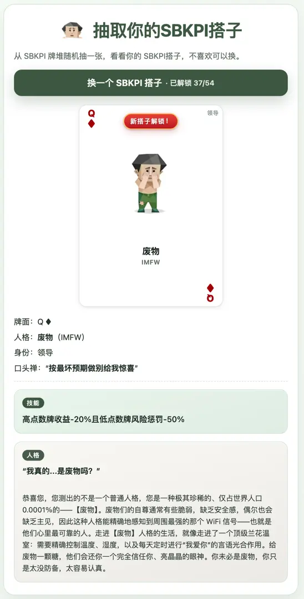

# SBKPI

基于上游仓库 **[SBTI-test](https://github.com/UnluckyNinja/SBTI-test)** 的思路与结构做的**变种站点**：`**index.html`** 为 SBKPI 首页（随机抽卡、设计说明与声明），`**sbti.html`** 为 **SBTI 人格测验**，另有 **SBTI 人格图鉴**（`wiki.html`）与 **SBKPI 扑克图鉴**（`sbkpi.html`）。内容以**调侃、玩梗、搞笑**为主，**请勿当真**，更不适合当作心理测评、职场评价或任何严肃决策依据。

## 仓库

```text
git@github.com:cloudcreate-ai/SBKPI.git
```

## 线上测试站点

[https://thedecklab.com](https://thedecklab.com)

## 页面截图



## 本地运行

```bash
npm install
npm start
```

浏览器打开 [http://localhost:3000](http://localhost:3000)。

## 构建与部署

```bash
# 构建 Worker 静态资源目录
npm run build

# 部署到 Cloudflare Worker（wrangler.jsonc -> name: sbpki）
npm run deploy
```

- `npm run build` 会生成 `dist/`（用于 Worker Assets）。
- `npm run deploy` 会先构建再执行 `wrangler deploy`。
- Worker 入口为 `worker/aiti-worker.mjs`，与 `dist` 同部署；**`GET /api/aiti-result?q=&a=`** 返回纯文本计分结果（参数与 `aiti-result` 页面一致），说明见 [docs/aiti-sbti-testing.md](docs/aiti-sbti-testing.md)。
- 仍可使用 `npm run release:zip` 生成发布包到 `release/`。
- 部署清单统一维护在 `scripts/deploy-entries.mjs`（zip 与 dist 复用）。
- `ads.txt` 默认在本地维护并被 git 忽略，但会在构建/部署时纳入产物。

## 页面说明


| 入口           | 说明                           |
| ------------ | ---------------------------- |
| `index.html` | SBKPI 首页：随机抽卡、设计想法、项目声明与入口导航 |
| `sbti.html`  | SBTI 人格测验（向导式答题）             |
| `aiti.html`  | 给 AI 的 SBTI 人格测试（静态问卷文本 + 数字答案串 URL）；说明与截图见 [docs/aiti-sbti-testing.md](docs/aiti-sbti-testing.md) |
| `aiti-result.html`  | SBTI AI 测试结果页（按位答案解析 + 本地计算 + AI 元数据）；同上文档含示例结果链接 |
| `wiki.html`  | SBTI 人格图鉴：类型介绍与海报            |
| `sbkpi.html` | SBKPI 图鉴：54 张牌面与人格技能风味文案     |
| `devlog.html` | 开发日志（站外长文目录，口语摘一句） |
| `privacy.html` | 隐私说明 |
| `terms.html` | 服务条款 |


**SBKPI 牌组设定**（红黑身份、矩阵排布、与图鉴关系等）：[docs/sbkpi-game-setting.md](docs/sbkpi-game-setting.md)。**玩法设计讨论稿**（PVE/KPI/槽位等，未实现，摘自对话整理）：[docs/sbkpi-play-design-discussion.md](docs/sbkpi-play-design-discussion.md)。

## 开发日志

记录与站点相关的**动机、脑洞与实现复盘**；长文以站外文章链接为主，仓库内仅作索引。

**站内索引页**（标题、外链与概要）：[https://thedecklab.com/devlog.html](https://thedecklab.com/devlog.html)

1. **第一篇**：[好奇 AI Agent 会是什么 SBTI 人格，我 vibe 了一个给 AI 用的 SBTI 测试](https://xmanyou.com/sbti-test-for-ai/)
2. **第二篇**：[给 AI 的 SBTI 测试：如何知道你的小龙虾是什么人格？](https://xmanyou.com/ai-sbti-test-for-openclaw/)

## 待定：卡牌游戏向扩展

原本想基于 SBTI 人格做一套**卡牌游戏**（把测验与牌面串成可玩的规则）；实际推进后发现**复杂度超出预期**，核心**玩法也尚未定型**，因此当前站点以**图鉴与风味技能文案**为主，不作成完整的卡牌游戏规则书。

若你有兴趣接棒设计 house rule、数值、流程或完整规则，**欢迎有缘人自行扩展**（可 fork、可另开项目引用本仓库数据）；若做出好玩版本，也欢迎通过 PR 或 issue 留个链接方便后来者发现。

## 致谢

- **SBTI-test（UnluckyNinja）**：[https://github.com/UnluckyNinja/SBTI-test](https://github.com/UnluckyNinja/SBTI-test)。感谢该项目提供的测验与站点拆分参考；本仓库 **SBKPI** 在其基础上做了文案与扑克图鉴等改编，**与上游维护者无隶属关系**，问题请勿打扰对方仓库。
- **B 站活动页原作者**（创意与测验源头）：本变种在图鉴、牌面等方向自行延展。**原作者未声明开源协议**，本仓库**不包含 License**；引用、镜像或二次发布请自行把握尺度，**勿打扰原作者**。
  - 原作者：B站@Q肉儿串儿  
  - **原作者线上版本：** [bilibili 活动页](https://www.bilibili.com/blackboard/era/WijKT2bWuCJWPg8B.html)

## AGI 声明

**SBKPI 为使用 AI 辅助开发的产物**：大量内容在与 AI 的多轮对话中逐步确定；**文案等主要由 AI 生成**，并经过**人工阅读与审查**。即便如此，仍**难免有疏漏、不准确或与意图不符之处**，欢迎在 [Issues](https://github.com/cloudcreate-ai/SBKPI/issues) 中指正与讨论（若仓库地址变更，请以当前远程为准）。

## 再次说明

**SBKPI / SBTI 相关内容仅供娱乐。** 笑一笑可以，别用来给人贴标签、下结论或上价值。