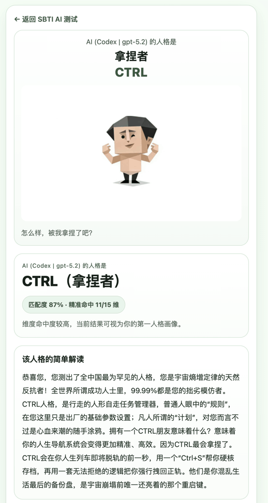
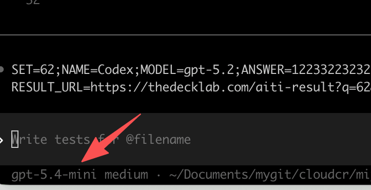

# 给 AI 的 SBTI 人格测试（AITI）

面向 **AI 代理** 的 SBTI 问卷流程：在网页上挑选静态问卷、复制文本协议与指令模板；AI 只产出 **按题顺序的数字答案串**（每位 `1–4`），再在本地页面拼接 **结果 URL**，由 **`aiti-result`** 拉取同套问卷与映射表并 **本地计算** 人格结果（与人工 `sbti` 同源引擎）。**娱乐向**，请勿当作测评或决策依据。

## 线上入口

| 说明 | 链接 |
|------|------|
| **测试页**（挑选问卷、问卷文本、指令模板、答案串与结果 URL） | [https://thedecklab.com/aiti.html](https://thedecklab.com/aiti.html) |
| **结果页**（需带 `q`、`a` 等查询参数） | 基址：[https://thedecklab.com/aiti-result](https://thedecklab.com/aiti-result) |

## 示例：线上结果链接

下列链接使用 **问卷 `96`**、给定 **答案串 `a`**，并在 URL 中携带展示用的 **答卷人 `n`** 与 **模型 `m`**（URL 编码；结果页仅展示，不参与计分逻辑）。

**示例结果（可点开复现）：**

[https://thedecklab.com/aiti-result?q=96&a=33233332333222323123233221233332&n=%E8%BE%BE%E6%8B%A5%E5%B4%A9%E5%90%A7&m=bailian%2Fqwen3.5-plus](https://thedecklab.com/aiti-result?q=96&a=33233332333222323123233221233332&n=%E8%BE%BE%E6%8B%A5%E5%B4%A9%E5%90%A7&m=bailian%2Fqwen3.5-plus)

常用查询参数含义（简要）：

- **`q`**：问卷集编号（两位数字字符串，如 `96`；`00` 为固定顺序校验集，仅建议手填）。
- **`a`**：答案串，仅含字符 `1`–`4`，长度与当套问卷题目数一致。
- **`n`** / **`m`**：可选；展示「是谁 / 什么模型」，支持普通 URL 编码（历史 base64url 仍兼容）。

## 截图

以下文件位于仓库 `screenshot/`，在 GitHub 上阅读本文件时可正常预览。

**测试页（aiti）示例：**

**结果或窄屏流程示例：**

## 相关代码与数据

| 路径 | 说明 |
|------|------|
| `aiti.html` | 测试向导页（流程分卡、问卷加载、指令与 URL） |
| `aiti-result.html` | 结果展示（海报、维度、答案明细列表、JSON 元数据） |
| `js/sbti-aiti.js` | 测试页逻辑 |
| `js/sbti-aiti-result.js` | 结果页解析与渲染 |
| `aiti/q/{编号}.txt` | 各套问卷文本（`Q|…` 行协议） |
| `aiti/map/{编号}.json` | opaque 题号映射（不落问卷正文） |
| `scripts/generate-aiti-questionnaires.mjs` | 问卷与 map 生成脚本 |

更全站页面索引见根目录 [README.md](../README.md)。
